# Performance Studio — Architecture & Flow Diagrams

All diagrams use [Mermaid](https://mermaid.js.org/) and render natively on GitHub.

---

## Table of Contents

1. [System Architecture](#1-system-architecture)
2. [Data Model](#2-data-model)
3. [User Journey](#3-user-journey)
4. [Role-Based Access Model](#4-role-based-access-model)
5. [AI Script Generation Flow](#5-ai-script-generation-flow)
6. [Pre-Run Flow](#6-pre-run-flow)
7. [Test Execution Flow](#7-test-execution-flow)
8. [Auto-Heal Flow](#8-auto-heal-flow)
9. [Git & CI Integration Flow](#9-git--ci-integration-flow)
10. [CI Pipeline Flow](#10-ci-pipeline-flow)
11. [Alert & Email Flow](#11-alert--email-flow)
12. [Multi-Environment Isolation](#12-multi-environment-isolation)
13. [Security Model](#13-security-model)
14. [Technology Stack](#14-technology-stack)

---

## 1. System Architecture

High-level view of every component and how they relate.

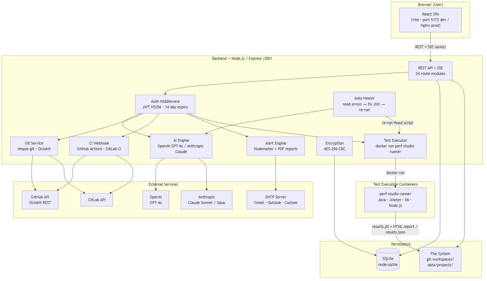

---

## 2. Data Model

Entity-relationship diagram for the SQLite database.

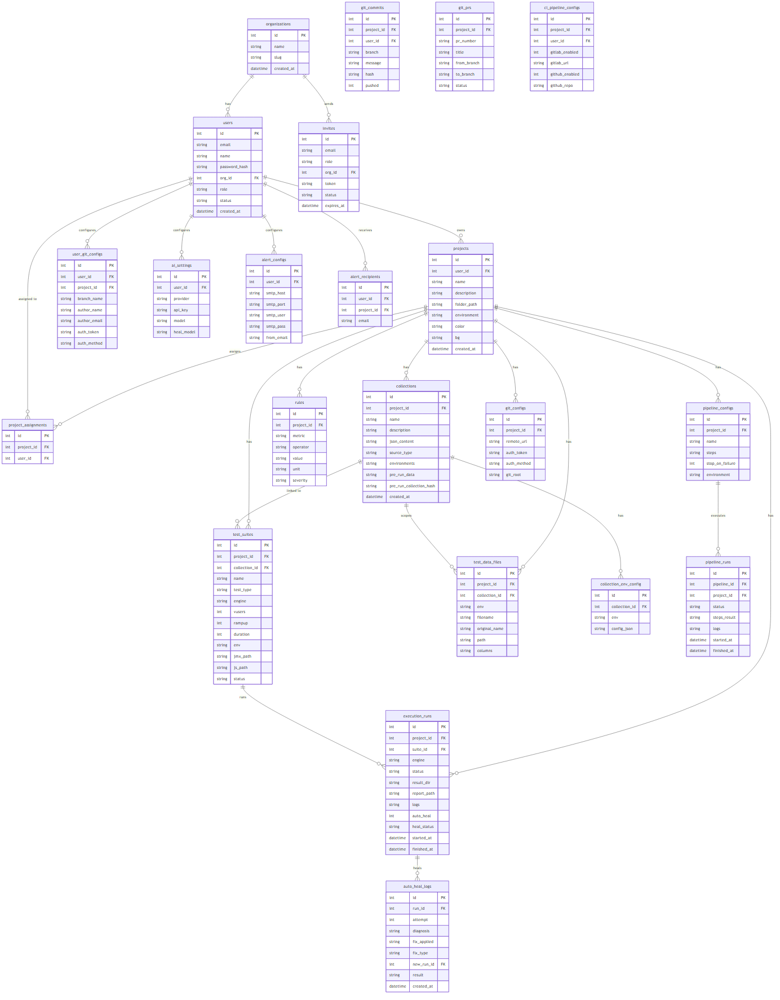

---

## 3. User Journey

End-to-end flow from account creation to a passing test run.

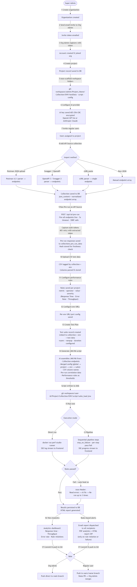

---

## 4. Role-Based Access Model

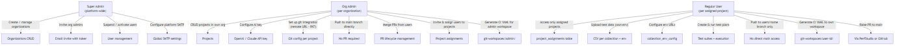

---

## 5. AI Script Generation Flow

How a test plan becomes an executable JMeter or K6 script.

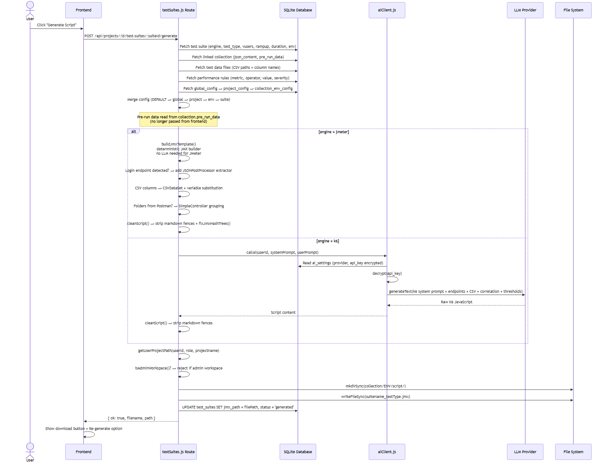

---

## 6. Pre-Run Flow

How live API responses are captured to power correlation and token extraction in generated scripts.

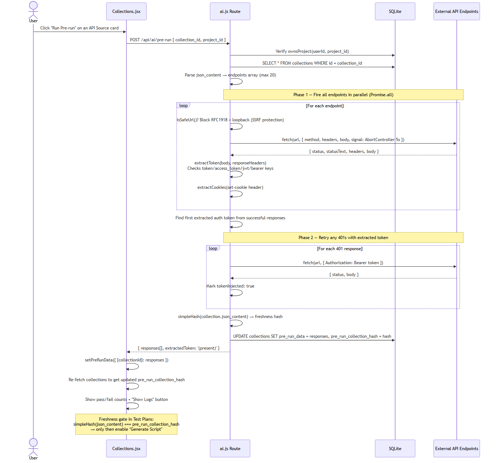

---

## 7. Test Execution Flow

How a test run is triggered, streamed, and reported.

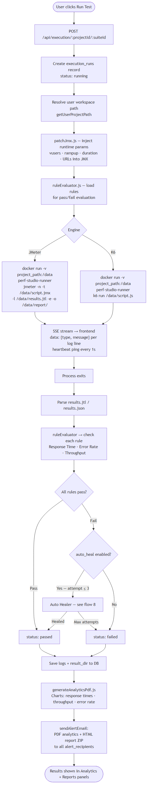

---

## 8. Auto-Heal Flow

How failed test scripts are automatically diagnosed and fixed by AI.

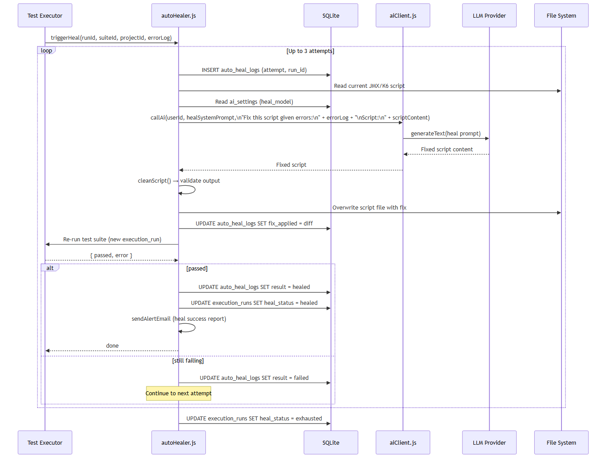

---

## 9. Git & CI Integration Flow

How test scripts are versioned, pushed, and merged via Git.

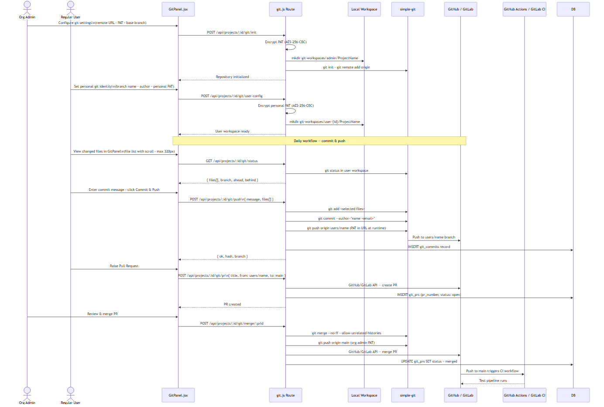

---

## 10. CI Pipeline Flow

How sequential performance test pipelines are configured, triggered, and tracked.

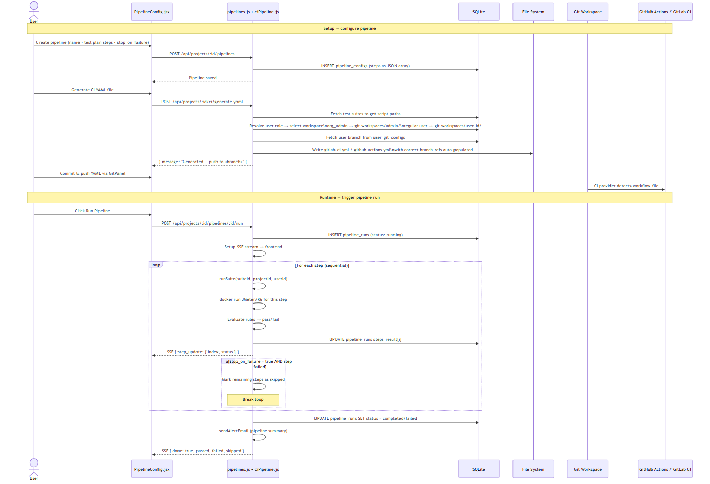

---

## 11. Alert & Email Flow

How test results trigger email notifications with analytics.

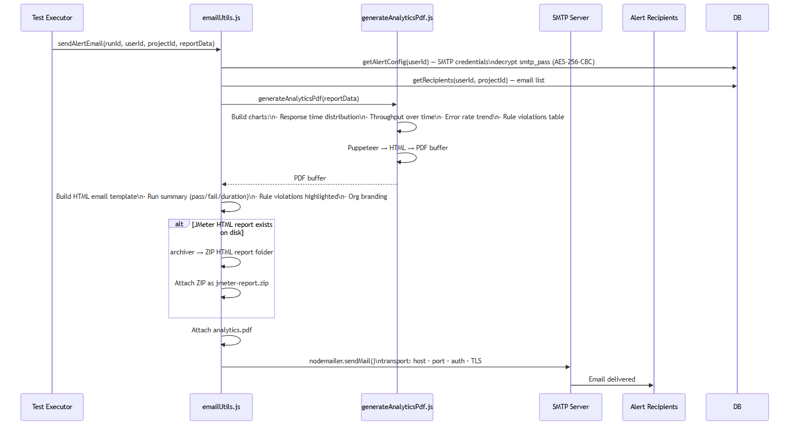

---

## 12. Multi-Environment Isolation

```
git-workspaces/
├── admin/                                ← Org Admin workspace (main branch)
│   └── Project_Name/
│       ├── .git/
│       ├── .gitignore
│       └── Project_Name/
│           └── CollectionName_ID/
│               ├── QA/
│               │   ├── testData/         ← env-scoped CSV files
│               │   ├── script/           ← generated JMX / K6 scripts
│               │   ├── results/          ← JMeter results.jtl + HTML report
│               │   └── config/           ← config.json (URLs · rules · test plans)
│               ├── Staging/
│               ├── UAT/
│               └── Production/
│
└── user-{id}/                            ← Regular user workspace (users/name branch)
    └── Project_Name/
        └── (same structure as above)
```

**Isolation guarantees:**
- Every DB query that touches test data, configs, or scripts is scoped by `collection_id + env`
- Switching environment in the UI never shows data from another environment
- Regular users write only to their own `user-{id}` workspace; admin workspace is read-only for users
- Script generation is blocked in the admin workspace — users must generate in their own workspace

---

## 13. Security Model

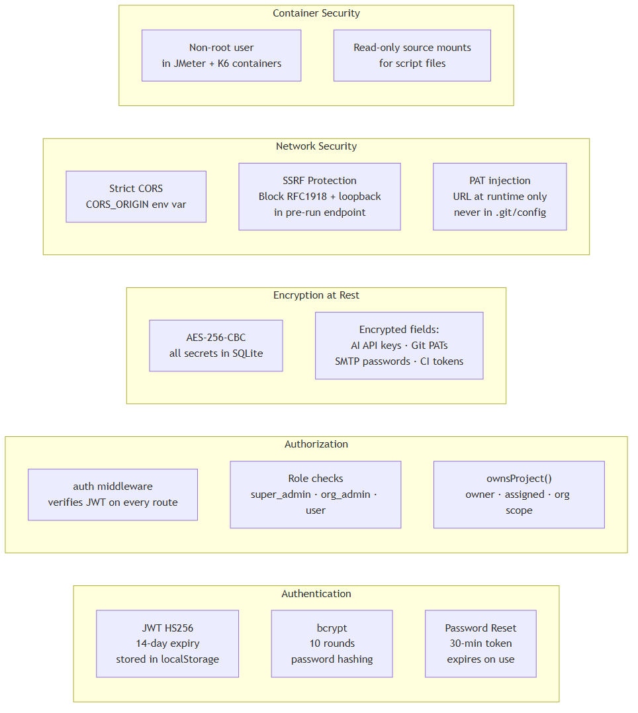

| Concern | Implementation |
|---|---|
| **Authentication** | JWT HS256, 14-day expiry, `auth` middleware on all routes |
| **Password storage** | bcrypt, 10 rounds |
| **Password reset** | Single-use token, 30-minute expiry |
| **API keys / PATs / SMTP passwords** | AES-256-CBC encrypted in SQLite — never returned via API |
| **Git push authentication** | PAT injected into HTTPS URL at runtime only, never persisted in `.git/config` |
| **Route authorization** | Role checks per operation; `ownsProject()` for all project-scoped routes |
| **SSRF protection** | Pre-run blocks RFC1918 IPs, loopback, and requires http/https scheme |
| **CORS** | Strict origin whitelist via `CORS_ORIGIN` env var |
| **Docker containers** | Non-root user; read-only source mounts |
| **Invite system** | Scoped token per email+org+role; expires 7 days after creation |

---

## 14. Technology Stack

| Layer | Technology |
|---|---|
| **Frontend** | React 18, Vite 5, axios, react-chartjs-2 / chart.js |
| **Backend** | Node.js, Express 4, nodemon (dev) |
| **Database** | SQLite via `node:sqlite` (built-in, no native deps) |
| **AI Generation** | OpenAI GPT-4o (`openai` SDK) · Anthropic Claude (`@anthropic-ai/sdk`) |
| **Test Engines** | Apache JMeter · Grafana K6 — both run inside the `perf-studio-runner` Docker image (Java · Node.js pre-installed) |
| **Git Integration** | `simple-git` (local ops) · `@octokit/rest` (GitHub API) · GitLab REST API |
| **Email** | `nodemailer` (SMTP transport, TLS) |
| **PDF Reports** | `puppeteer` (HTML → PDF) · `pdfkit` |
| **Excel / CSV** | `xlsx` (frontend parsing) · custom CSV parser (backend) |
| **Encryption** | `crypto` (Node built-in AES-256-CBC) · `bcryptjs` |
| **File uploads** | `multer` (memory + disk storage) |
| **Backups** | `archiver` (ZIP on project delete) |
| **Containerisation** | Docker · Docker Compose (all-in-one + multi-service modes) |
| **CI/CD** | GitHub Actions (`workflow_dispatch`) · GitLab CI (`pipeline_trigger`) |
| **Deployment** | Single Docker image (`Dockerfile`) or Compose stack |
