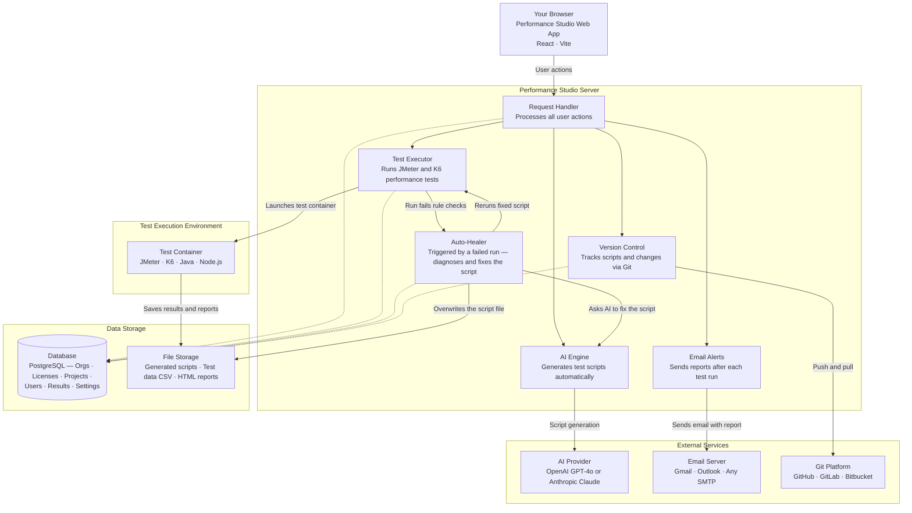
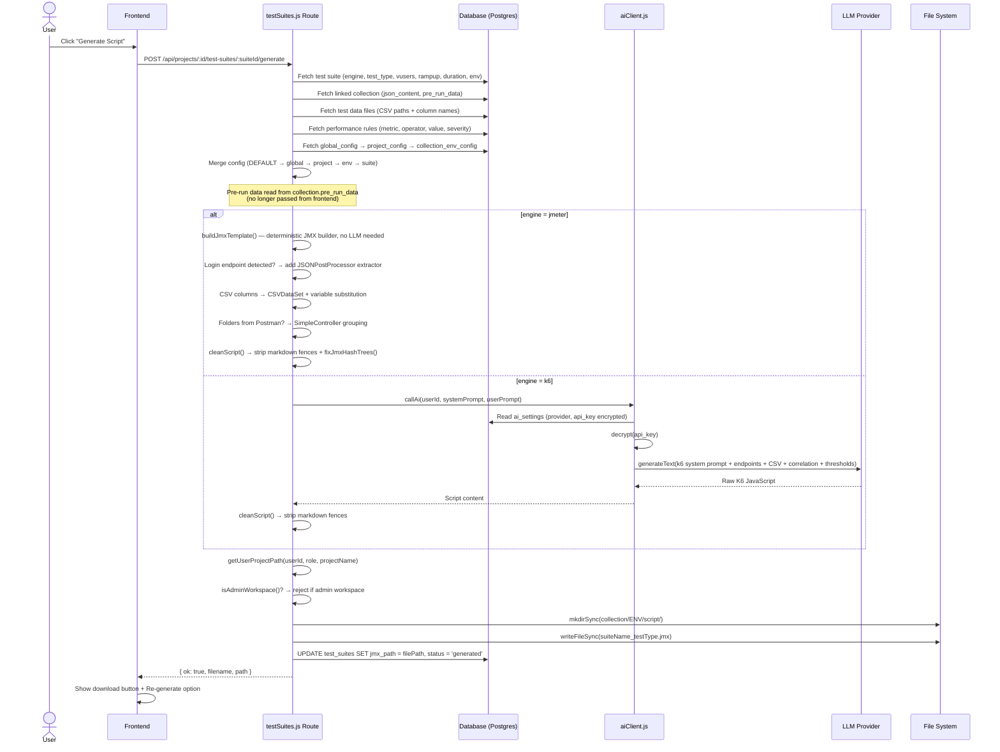
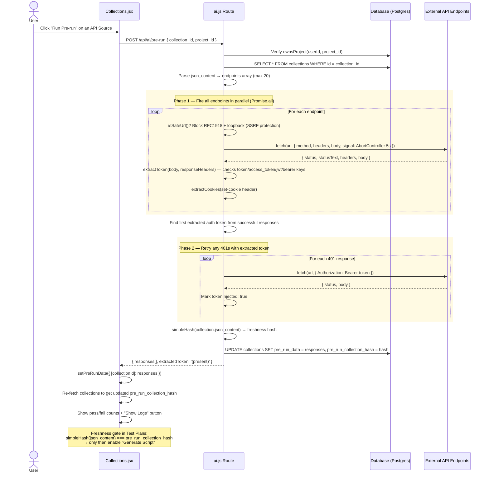
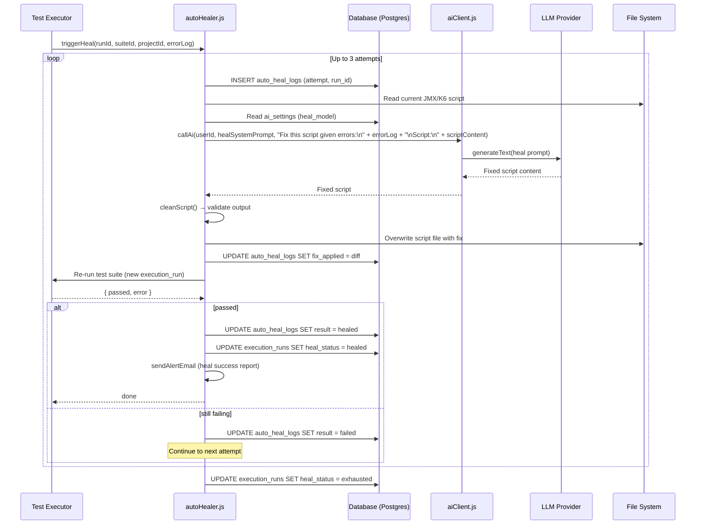
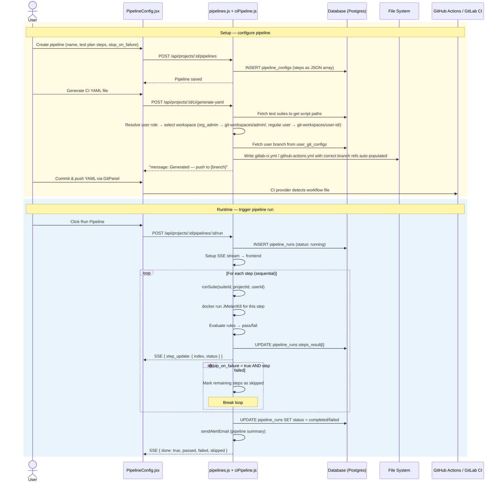
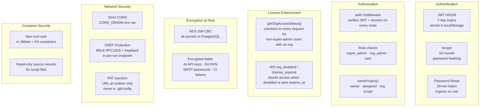

# Performance Studio — Architecture & Flow Diagrams

All diagrams use [Mermaid](https://mermaid.js.org/) and render natively on GitHub.

---

## Table of Contents

1. [System Architecture](#1-system-architecture)
2. [Data Model](#2-data-model)
3. [User Journey](#3-user-journey)
4. [Role-Based Access Model](#4-role-based-access-model)
5. [AI Script Generation Flow](#5-ai-script-generation-flow)
6. [Pre-Run Flow](#6-pre-run-flow)
7. [Test Execution Flow](#7-test-execution-flow)
8. [Auto-Heal Flow](#8-auto-heal-flow)
9. [Git & CI Integration Flow](#9-git--ci-integration-flow)
10. [CI Pipeline Flow](#10-ci-pipeline-flow)
11. [Alert & Email Flow](#11-alert--email-flow)
12. [Multi-Environment Isolation](#12-multi-environment-isolation)
13. [Security Model](#13-security-model)
14. [Technology Stack](#14-technology-stack)
15. [Licensing System](#15-licensing-system)

---

## 1. System Architecture

High-level view of every component and how they relate.

> The static image previously here (`images/system-architecture.png`) had two stale points, fixed below: it still labeled the database "SQLite" (this app is fully migrated to PostgreSQL — see [Technology Stack](#14-technology-stack)), and it drew Auto-Healer as a peer of the normal request flow (fed directly by Request Handler, in parallel with AI Engine/Test Executor/Email/Git) rather than as a **reactive step triggered by a failed Test Executor run**. This is now a Mermaid diagram (matching this doc's own stated approach) so it stays text-diffable and doesn't drift out of sync again.



**Why Auto-Healer sits where it does**: `autoHealer.js` is only ever invoked after a test run's results fail rule evaluation by `ruleEvaluator.js` (see [PROJECT_MAP.md](../PROJECT_MAP.md#backend-services-utils)) — it is never a step in the normal request path. It asks the AI Engine for a fix, overwrites the script file directly on disk (confirmed: it never calls git itself), then reruns via the Test Executor — up to 3 attempts. Committing the healed script to Git is a separate, manual step the user takes afterward via the Git panel, same as any other script change.

---

## 2. Data Model

Entity-relationship diagram for the PostgreSQL database (schema in `backend/src/db/schema.sql`, applied by `migrate.js`). Note: the diagram image below predates the licensing system (`org_licenses` table) and may not show it — see [Licensing System](#15-licensing-system) for that addition.


---

## 3. User Journey

End-to-end flow from account creation to a passing test run.


---

## 4. Role-Based Access Model


---

## 5. AI Script Generation Flow

How a test plan becomes an executable JMeter or K6 script.



---

## 6. Pre-Run Flow

How live API responses are captured to power correlation and token extraction in generated scripts.



---

## 7. Test Execution Flow

How a test run is triggered, streamed, and reported.


---

## 8. Auto-Heal Flow

How failed test scripts are automatically diagnosed and fixed by AI. **This is a reactive step, triggered only after a test run's results fail rule evaluation — it is never part of the normal generate/run request path** (see the corrected [System Architecture](#1-system-architecture) diagram above).



**Note**: `autoHealer.js` writes the fixed script directly to the **File System** — it never calls git. Committing the healed script (and pushing/raising a PR) remains a separate, manual step the user takes afterward via the Git panel, same as any other script change.

---

## 9. Git & CI Integration Flow

How test scripts are versioned, pushed, and merged via Git.


---

## 10. CI Pipeline Flow

How sequential performance test pipelines are configured, triggered, and tracked.



---

## 11. Alert & Email Flow

How test results trigger email notifications with analytics.


---

## 12. Multi-Environment Isolation

```
git-workspaces/
├── admin/                                ← Org Admin workspace (main branch)
│   └── Project_Name/
│       ├── .git/
│       ├── .gitignore
│       └── Project_Name/
│           └── CollectionName_ID/
│               ├── QA/
│               │   ├── testData/         ← env-scoped CSV files
│               │   ├── script/           ← generated JMX / K6 scripts
│               │   ├── results/          ← JMeter results.jtl + HTML report
│               │   └── config/           ← config.json (URLs · rules · test plans)
│               ├── Staging/
│               ├── UAT/
│               └── Production/
│
└── user-{id}/                            ← Regular user workspace (users/name branch)
    └── Project_Name/
        └── (same structure as above)
```

**Isolation guarantees:**
- Every DB query that touches test data, configs, or scripts is scoped by `collection_id + env`
- Switching environment in the UI never shows data from another environment
- Regular users write only to their own `user-{id}` workspace; admin workspace is read-only for users
- Script generation is blocked in the admin workspace — users must generate in their own workspace

---

## 13. Security Model



| Concern | Implementation |
|---|---|
| **Authentication** | JWT HS256, 7-day expiry (`auth.js`'s `JWT_EXPIRES`), `auth` middleware on all routes |
| **Session control** | Every JWT carries a `jti`; `user_sessions` enforces one active session per user server-side (logging in elsewhere invalidates the old session unless `force: true`), and sessions expire after 30 minutes of inactivity (`last_used_at`) |
| **Password storage** | bcrypt, 10 rounds |
| **Password reset** | Single-use token, 30-minute expiry |
| **API keys / PATs / SMTP passwords** | AES-256-CBC encrypted at rest in PostgreSQL — never returned via API (masked or presence-flagged instead) |
| **Git push authentication** | PAT injected into HTTPS URL at runtime only, never persisted in `.git/config` |
| **Route authorization** | Role checks per operation; `ownsProject()` for all project-scoped routes |
| **License enforcement** | `auth` middleware checks the caller's org license (`getOrgAccessStatus()`) on every request for non-super-admin users — `403 org_disabled` / `license_expired` blocks access when the org's license is disabled or past `expires_at` |
| **SSRF protection** | Pre-run blocks RFC1918 IPs, loopback, and requires http/https scheme |
| **CORS** | Strict origin whitelist via `CORS_ORIGIN` env var |
| **Docker containers** | Non-root user; read-only source mounts |
| **Invite system** | Scoped token per email+org+role; expires 7 days after creation |

---

## 14. Technology Stack

| Layer | Technology |
|---|---|
| **Frontend** | React 18, Vite 5, axios, react-chartjs-2 / chart.js, html2canvas, jsPDF, xlsx |
| **Backend** | Node.js, Express 4, nodemon (dev) |
| **Database** | PostgreSQL via `pg` (`db/index.js` is the entry point every route imports, re-exporting `db/pg.js`'s async wrapper; `schema.sql` applied by `migrate.js`). No SQLite code remains — the migration is fully complete. |
| **AI Generation** | OpenAI GPT-4o (`openai` SDK) · Anthropic Claude — routed through one client (`utils/aiClient.js`); Anthropic is called via an OpenAI-compatible endpoint shape |
| **Test Engines** | Apache JMeter 5.6.3 · Grafana K6 — bundled in the all-in-one Docker image for native execution, or spawned as containers when `EXECUTION_MODE=docker` |
| **Git Integration** | `simple-git` (local ops) · `@octokit/rest` (GitHub API) · raw HTTP for GitLab/Bitbucket REST APIs |
| **Email** | `nodemailer` (SMTP transport, TLS) |
| **PDF Reports** | `puppeteer` (HTML → screenshot) · `pdfkit` (page stitching) |
| **Excel / CSV** | `xlsx` (frontend parsing) · custom CSV parser (backend) |
| **Encryption** | `crypto` (Node built-in AES-256-CBC) · `bcryptjs` |
| **File uploads** | `multer` (memory + disk storage) |
| **Backups** | `archiver` (ZIP on project delete) |
| **Containerisation** | Docker · Docker Compose (`postgres` + all-in-one app service) |
| **CI/CD** | GitHub Actions (`workflow_dispatch`) · GitLab CI (`pipeline_trigger`) · Bitbucket Pipelines |
| **Deployment** | Single Docker image (`Dockerfile`) or Compose stack, with a Postgres service alongside it |

---

## 15. Licensing System

Every organization has one `org_licenses` row (`plan`, `max_users`, `max_projects` — `NULL` = unlimited, `status` active/disabled, `expires_at`). New orgs lazily get a `trial` row (2 users / 1 project / 7 days) the first time they're accessed if none exists yet.

| Plan | Max Users | Max Projects | Duration |
|---|---|---|---|
| trial | 2 | 1 | 7 days |
| starter | 5 | 3 | 180 days |
| growth | 15 | 10 | 180 days |
| business | 30 | 20 | 180 days |
| enterprise | unlimited | unlimited | 180 days |

- **Enforcement**: `middleware/auth.js` checks `getOrgAccessStatus()` on every authenticated request for non-super-admin users with an org, returning `403 org_disabled`/`license_expired` when invalid. Invite creation/acceptance and project creation additionally check `usersAtLimit`/`projectsAtLimit`.
- **Management**: `routes/licenses.js` (`/api/licenses/*`) exposes plan tiers, the caller's own org's license (`/mine`), and full CRUD for super admins. `routes/orgs.js`'s `POST /` creates an org + its initial license (and optionally sends the first Org Admin invite) in one call.
- **Super Admin UI**: consolidated into a single page, `frontend/src/pages/OrganizationsAdmin.jsx` — stat cards plus an org list/detail view with Overview / Edit Details / License & Limits / Org Admins tabs. Super admins have no Sidebar — this Organizations console is their only destination.
