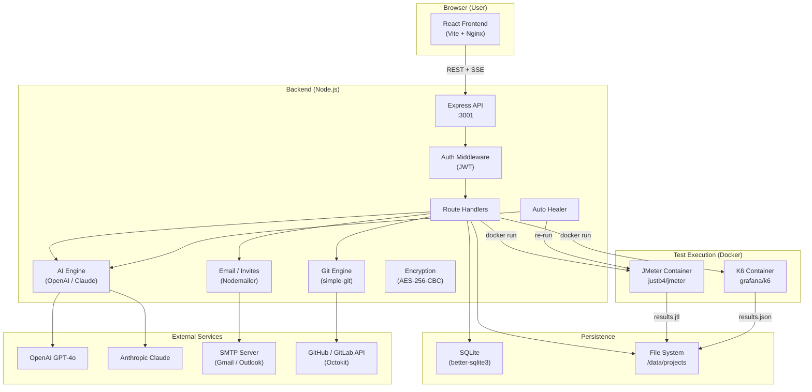

# Performance Studio — Architecture

## System Overview



---

## Multi-Environment Isolation

```
projects/
└── Project_Name_workspace/          ← git repo root
    ├── .git/                         ← git history
    ├── .gitignore
    └── Project_Name/                 ← visible subfolder on GitHub
        ├── Collection_Name_ID/       ← per API source
        │   ├── QA/
        │   │   ├── testData/         ← env-specific CSV files
        │   │   ├── script/           ← generated JMX/JS scripts
        │   │   ├── results/          ← test run output
        │   │   └── config/           ← URL + port config JSON
        │   ├── Staging/
        │   └── UAT/
        └── README.md
```

Each environment is **strictly isolated** — test data, configs, scripts and results are tagged
by `collection_id + env` in the database so switching envs never shows data from another env.

---

## Role-Based Access Model

```
Super Admin
  ├── Create organizations
  ├── Invite Org Admins (assigns them to an org)
  └── Configure platform SMTP

Org Admin (per organization)
  ├── Create projects
  ├── Invite regular users → assign to projects
  ├── Configure AI (GPT-4o / Claude)
  ├── Set up Git integration (PAT, remote URL)
  ├── Push to main branch directly
  ├── Merge PRs from team members
  └── Reset user passwords

Regular User (assigned to specific projects)
  ├── Upload test data (env-specific)
  ├── Configure environment URLs
  ├── Create & run test plans
  ├── Push to users/<name> branch
  └── Raise pull requests to main
```

---

## Git Integration Architecture

```
PerfStudio Server
  └── /data/projects/
       └── Project_workspace/     ← local git repo (git root)
           ├── .git/
           └── Project_Name/      ← project files tracked by git

GitHub Remote Repo
  └── Project_Name/               ← matches local workspace subfolder
      └── Collection/
          └── QA/
              ├── testData/
              ├── script/
              └── config/

Branch Strategy:
  main                ← Org Admin (direct push, no PR required)
  users/alice         ← Regular user Alice (PR required to merge)
  users/bob           ← Regular user Bob  (PR required to merge)
```

**PR lifecycle:**
1. User commits → pushes to `users/<name>`
2. User creates PR in PerfStudio (optionally synced to GitHub via Octokit)
3. Org Admin reviews in PerfStudio → clicks Merge
4. PerfStudio: `git merge --no-ff --allow-unrelated-histories` → push to `main`
5. PR status updated to `merged` in local DB + GitHub

---

## AI Script Generation Flow

```
User clicks "Generate Script"
        ↓
Backend reads:
  - Collection endpoints (from JSON/Postman/Swagger source)
  - Project config (threads, ramp-up, duration)
  - Env-specific URLs
  - Test data file columns (for CSV parameterization)
  - Pre-run response data (for correlation extraction)
  - Performance rules (for thresholds)
        ↓
System prompt + user prompt assembled
        ↓
OpenAI GPT-4o or Claude API call
        ↓
Raw JMX or JS returned
        ↓
Written to: projects/<project>/<collection>/<env>/script/<name>.jmx
        ↓
Script path saved in test_suites.jmx_path
```

---

## Test Execution Sequence

```
User clicks "Run Test"
        ↓
Backend: docker run -v <project_path>:/data justb4/jmeter -n -t /data/script.jmx
        ↓ (real-time)
SSE stream → Frontend (log lines, progress)
        ↓
Test completes
        ↓
If FAILED → Auto Healer
  - Reads error log
  - Calls AI: "Fix this JMX script given these errors"
  - Writes fixed script
  - Re-runs (up to 3 attempts)
  - Sends alert email after successful correction
        ↓
If PASSED
  - Results saved to /data/results/
  - Email alert sent with analytics
  - JMeter HTML report generated
```

---

## Database Schema (SQLite)

| Table | Purpose |
|---|---|
| `users` | All users (super_admin / org_admin / user) |
| `organizations` | Organizations managed by Super Admin |
| `projects` | Test projects (owned by org_admin) |
| `collections` | API sources per project |
| `rules` | Performance assertion rules per project |
| `test_suites` | Test plans (collection + env + script path) |
| `test_data_files` | CSV test data (tagged by collection_id + env) |
| `collection_env_config` | Per-env URL/port configuration |
| `global_config` | Global defaults |
| `project_config` | Project-level config overrides |
| `ai_settings` | AI provider + model selection per user |
| `alert_configs` | SMTP configuration per user |
| `alert_recipients` | Email recipients per project |
| `invites` | Invite tokens (pending / accepted / expired) |
| `password_resets` | Password reset tokens (30-min expiry) |
| `git_configs` | Git remote URL, PAT, workspace path per project |
| `git_prs` | Pull requests (local DB + optional GitHub PR URL) |
| `git_commits` | Commit log per project |

---

## Security Model

| Concern | Implementation |
|---|---|
| Authentication | JWT (HS256, 14-day expiry) |
| API Keys / PATs | AES-256-CBC encrypted in SQLite |
| SMTP Passwords | AES-256-CBC encrypted in SQLite |
| Password hashing | bcrypt (10 rounds) |
| Route authorization | `auth` middleware on all routes; role checks per operation |
| Git push auth | PAT injected into HTTPS URL at runtime, never stored in `.git/config` |
| Docker | Non-root user in containers; read-only source mounts |
| CORS | Strict origin whitelist via `CORS_ORIGIN` env var |
