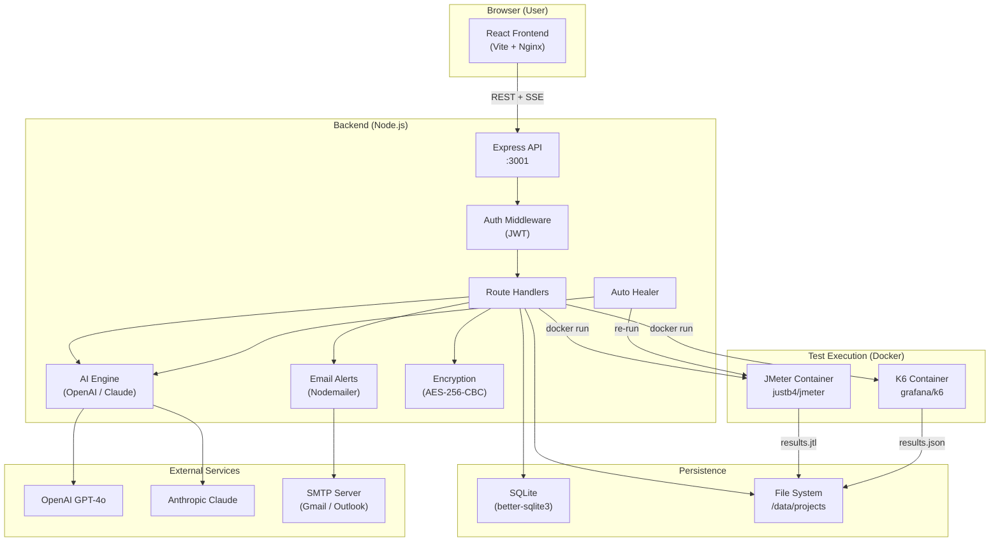
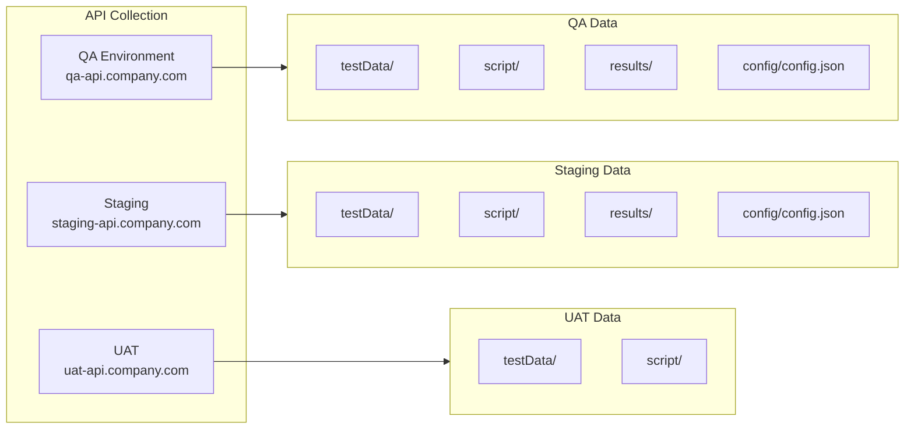
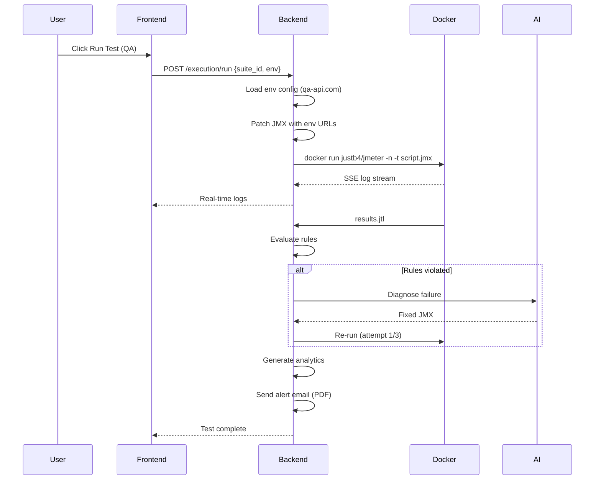
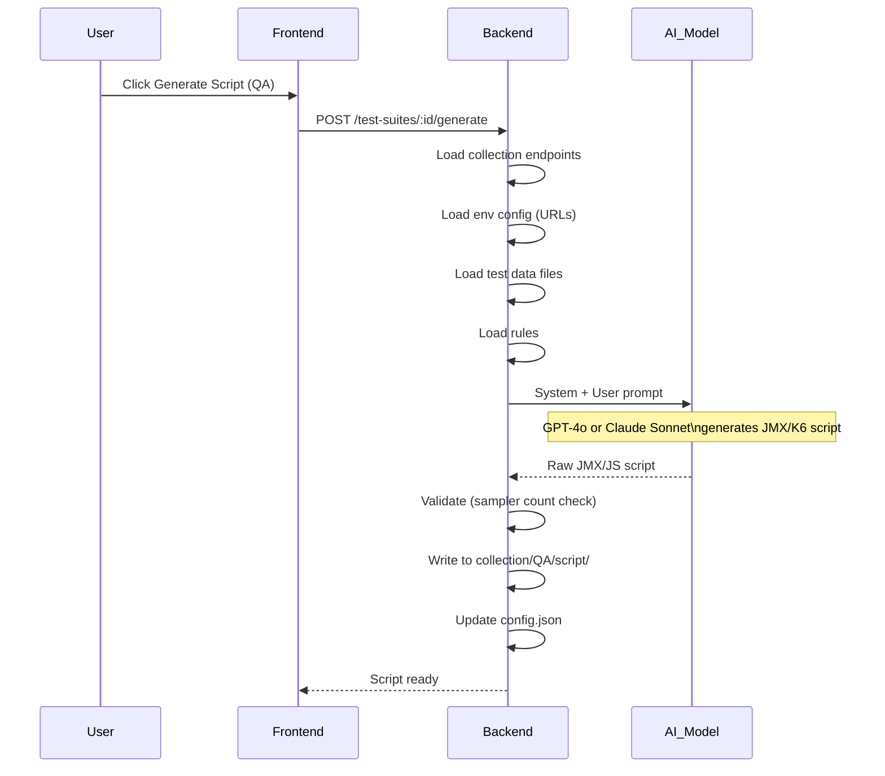
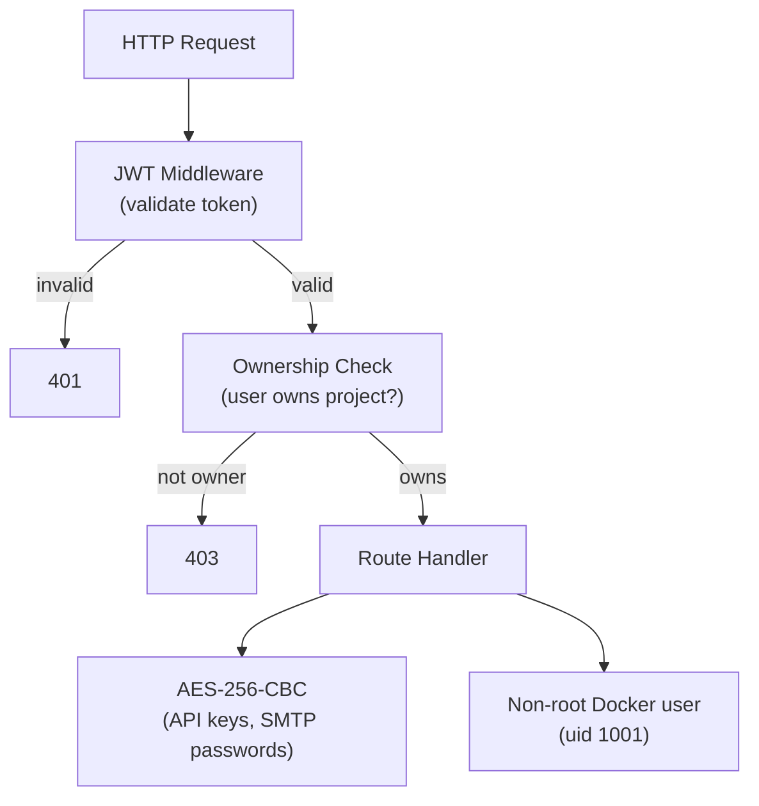

# Performance Studio — Architecture

## System Overview



## Data Model

```mermaid
erDiagram
    organizations ||--o{ users : "has"
    users ||--o{ projects : "owns"
    projects ||--o{ collections : "has"
    projects ||--o{ rules : "has"
    projects ||--o{ project_config : "has"
    collections ||--o{ test_suites : "linked to"
    collections ||--o{ test_data_files : "has"
    collections ||--o{ collection_env_config : "per env"
    test_suites ||--o{ execution_runs : "generates"
    execution_runs ||--o{ auto_heal_logs : "may have"
    users ||--o{ ai_settings : "configures"
    users ||--o{ alert_configs : "configures"
    users ||--o{ alert_recipients : "has"
    users ||--o{ global_config : "has"

    organizations { int id; string name; string slug }
    users { int id; string email; string name; string role; int org_id }
    projects { int id; string name; int user_id; string uuid; string folder_path }
    collections { int id; string name; int project_id; string environments; string json_content }
    collection_env_config { int id; int collection_id; string env; string config_json }
    test_suites { int id; string name; int collection_id; string env; string engine }
    execution_runs { int id; int suite_id; string status; string result_dir }
```

## Multi-Environment Architecture



## Test Execution Flow



## AI Script Generation Flow



## Security Model



## Directory Structure

```
perf-studio/
├── backend/                    ← Node.js Express API
│   ├── src/
│   │   ├── db/index.js         ← SQLite schema + migrations
│   │   ├── routes/             ← API route handlers
│   │   ├── middleware/         ← Auth, validation
│   │   └── utils/              ← AI, email, encryption, JMX patching
│   ├── Dockerfile
│   └── docker-entrypoint.sh
├── frontend/                   ← React + Vite → Nginx
│   ├── src/
│   │   ├── components/         ← Shared UI components
│   │   ├── pages/              ← Page components
│   │   └── utils/              ← Display helpers
│   ├── Dockerfile
│   └── nginx.conf
├── projects/                   ← Per-project data (gitignored)
│   └── ProjectName_ID_UUID/
│       └── CollectionName_ID/
│           ├── QA/             ← QA environment (fully isolated)
│           │   ├── testData/
│           │   ├── script/
│           │   ├── results/
│           │   └── config/config.json
│           └── Staging/        ← Staging environment
├── docs/
│   └── ARCHITECTURE.md
├── .github/workflows/
│   └── docker-publish.yml      ← Auto-build on push to main
├── docker-compose.yml
└── .env.example
```
